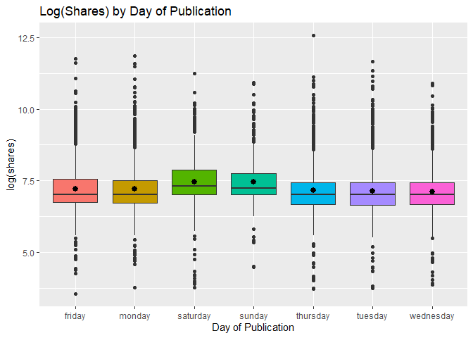
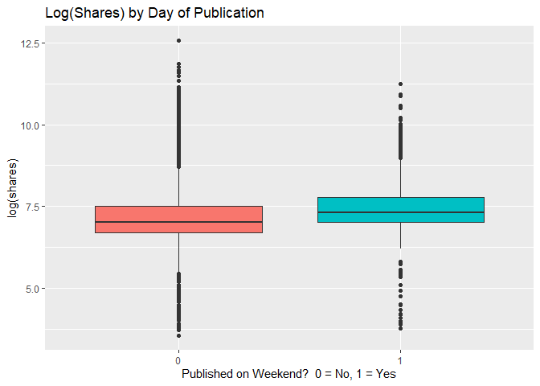
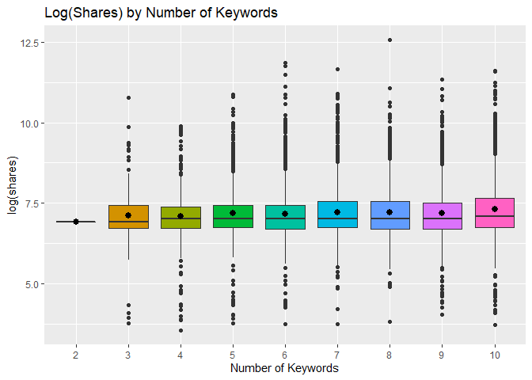
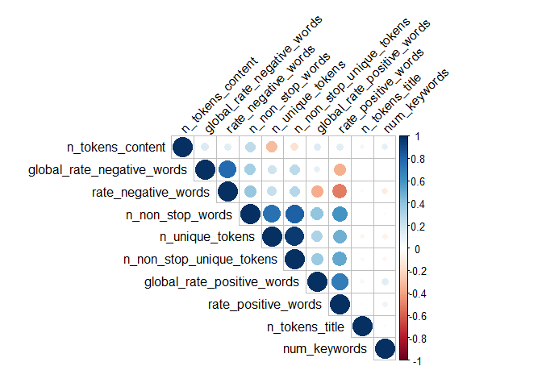
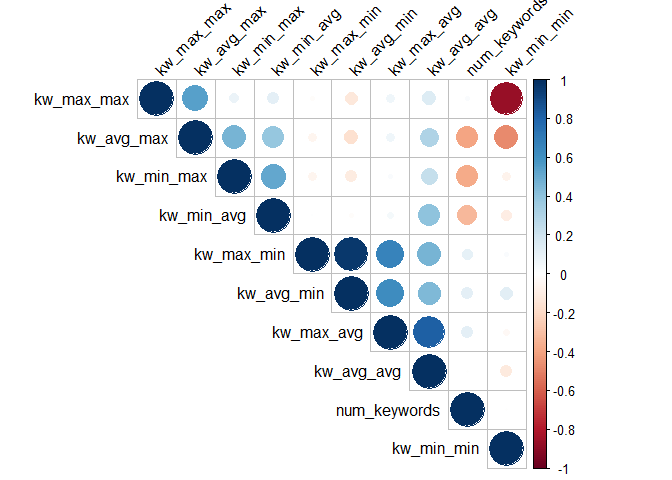
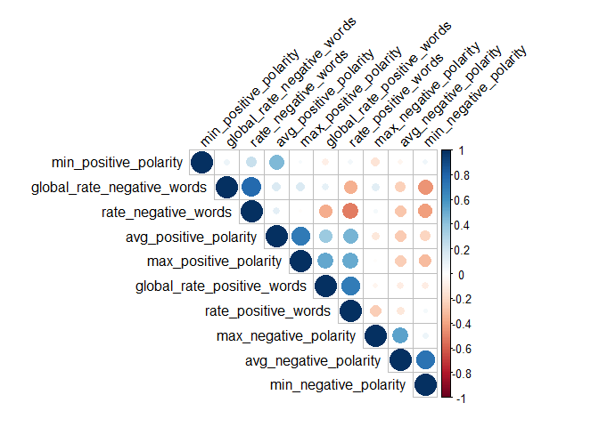
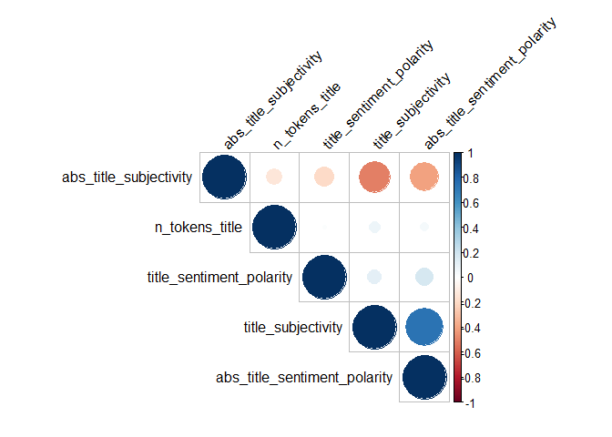

Project 2
================
Joey Chen and John Williams
10/24/2021

  - [Exploratory Data Analysis](#exploratory-data-analysis)
      - [Distribution of Response
        Variable](#distribution-of-response-variable)
      - [Log(shares) by Day of Week](#logshares-by-day-of-week)
      - [Summary by Interval](#summary-by-interval)
      - [Log(shares) by Number of
        Keywords](#logshares-by-number-of-keywords)
      - [Correlation](#correlation)

``` r
# read data
news_data <- read_csv("./OnlineNewsPopularity.csv")

# data cleaning
world_news_data <- news_data %>% 
                   # subset data by data channel
                   filter(data_channel_is_world == 1) %>%
                   # remove data channel variables
                   select(-starts_with("data_channel_is")) %>%
                   # remove non-predictive variables
                   select(-url, -timedelta)
```

# Exploratory Data Analysis

## Distribution of Response Variable

First, we can take a look at the distribution of our response variable
`shares`. We can first look at the histogram.

``` r
# Histogram of shares
ggplot(world_news_data, aes(x=shares)) +
  geom_histogram(bins=50) +
  labs(title="Histogram of shares")
```

<!-- -->

From the histogram We can see that the distribution is heavily right
skewed. The histogram scale may be influenced by potential outliers, so
we can look at the distribution of `shares` under 10,000.

``` r
# Histogram of shares < 5000
ggplot(filter(world_news_data, shares < 5000), aes(x=shares)) +
  geom_histogram(bins=50) +
  labs(title="Histogram of shares under 5000")
```

<!-- -->

As we can see, the distribution is still heavily right skewed. So we may
want to look at the distribution of `log(shares)`.

``` r
# Histogram of log(shares) 
ggplot(world_news_data, aes(x=log(shares))) +
  geom_histogram(bins=50) +
  labs(title="Histogram of log(shares)")
```

<!-- -->

From the histogram we can see that the distribution is slightly right
skewed. But it is much closer to normal compared to the original
distribution.

## Log(shares) by Day of Week

Since the range of the response variable `shares` is quite broad,
spanning from 1 to 843,300, we will use `log(shares)` to make the data
easier to view.

Let’s create a categorical variable `day_published` and determine if the
mean/median number of shares changes depending on what day the article
was published:

``` r
world_news_data2 <- world_news_data %>%
                    pivot_longer(starts_with("weekday"), 
                                 names_to = "day_published",
                                 names_prefix = "weekday_is_") %>%
                    filter(value == 1) %>%
                    select(-value)

ggplot(world_news_data2, aes(x = day_published, y = log(shares))) +
  geom_boxplot(aes(fill = day_published)) +
  stat_summary(fun.y = "mean") +
  theme(legend.position = "none") +
  labs(x = "Day of Publication", 
       title = "Log(Shares) by Day of Publication")
```

<!-- -->

After viewing the boxplot above, you should be able to determine what
day (or days) have the highest mean/median shares compared to other
days. The median is represented by the bold horizontal black line ithin
the colored box; the mean is represented by the black dot within the
colored box.

We can further see evidence of this by examining the categorical
variable `is_weekend`:

``` r
ggplot(world_news_data, aes(x = as.factor(is_weekend), y = log(shares))) +
  geom_boxplot(aes(fill = as.factor(is_weekend))) +
  theme(legend.position = "none") +
  labs(x = "Published on Weekend?  0 = No, 1 = Yes", 
       title = "Log(Shares) by Day of Publication")
```

<!-- -->

## Summary by Interval

Let’s examine the relationship between a continuous variable that is
within the range \[0, 1\] and `log(shares)`. One way we can do this by
“cutting” the variable into 11 subintervals ((-0.5, 0.5\], (0.5,
1.5\], (1.5, 2.5\], etc.) and calculating the mean/median `log(shares)`
for each subinterval. If the mean/median of `log(shares)` steadily
increases as the predictor increases, then there is a positive
relationship; if the mean/median of `log(shares)` steadily decreases as
the predictor increases, then there is a negative relationship. If there
is no clear pattern in the mean/median of `log(shares)` as the predictor
increases, then we cannot make any statement about the linear
relationship of that predictor and the response. For example,
`title_subjectivity` has a range \[0, 1\]. Let’s see how the mean/median
of `log(shares)` changes as `title_subjectivity` increases:

``` r
world_news_data %>%
  mutate(title_subjectivity = cut(title_subjectivity, 
                                  seq(-0.05, 1.05, by = 0.1))) %>%
  group_by(title_subjectivity) %>%
  summarise(mean = mean(log(shares)), median = median(log(shares)), n = n())
```

Similarly, we can examine `rate_negative_words`:

``` r
world_news_data %>%
  mutate(rate_negative_words = cut(rate_negative_words, 
                                   seq(-0.05, 1.05, by = 0.1))) %>%
  group_by(rate_negative_words) %>%
  summarise(mean = mean(log(shares)), median = median(log(shares)), n = n())
```

And `avg_positive_polarity`:

``` r
world_news_data %>%
  mutate(avg_positive_polarity = cut(avg_positive_polarity, 
                                     seq(0, 1, by = 0.1), right = FALSE)) %>%
  group_by(avg_positive_polarity) %>%
  summarise(mean = mean(log(shares)), median = median(log(shares)), n = n())
```

## Log(shares) by Number of Keywords

Is the number of keywords influential in determining the number of
shares? Let’s transform `num_keywords` into a categorical variable and
create a boxplot. The boxplot will show us if any particular number of
keywords is related to higher number of shares.

``` r
ggplot(world_news_data, aes(x = as.factor(num_keywords), y = log(shares))) +
  geom_boxplot(aes(fill=as.factor(num_keywords))) +
  stat_summary(fun.y = "mean") +
  theme(legend.position = "none") +
  labs(x = "Number of Keywords", 
       title = "Log(Shares) by Number of Keywords")
```

<!-- -->

## Correlation

Now, before creating our prediction models, we need to examine the
correlation among predictors, as we would not want to include predictors
in the model that are highly correlated. Since we have a large number of
predictors, let’s attempt to subset the predictors based on measuring
similar attributes.

``` r
# Create a correlogram for predictors that measure attributes of "tokens" 
# and "words"
cor1 <- world_news_data %>% select(contains("tokens"), contains("words"))
cormatrix <- round(cor(cor1), 2)
corrplot(cormatrix, type = "upper", order = "hclust", 
         tl.col = "black", tl.srt = 45)
```

<!-- -->

``` r
# Create a correlogram for predictors that measure attributes of keywords 
cor2 <- world_news_data %>% select(contains("keywords"), contains("kw"))
cormatrix <- round(cor(cor2), 2)
corrplot(cormatrix, type = "upper", order = "hclust", 
         tl.col = "black", tl.srt = 45)
```

<!-- -->

``` r
# Create a correlogram for predictors that measure attributes of "positve" and
# "negative" connotation 
cor3 <- world_news_data %>% select(contains("positive"), contains("negative"))
cormatrix <- round(cor(cor3), 2)
corrplot(cormatrix, type = "upper", order = "hclust", 
         tl.col = "black", tl.srt = 45)
```

<!-- -->

``` r
# Create a correlogram for predictors that measure attributes of article titles
cor4 <- world_news_data %>% select(contains("title"))
cormatrix <- round(cor(cor4), 2)
corrplot(cormatrix, type = "upper", order = "hclust", 
         tl.col = "black", tl.srt = 45)
```

<!-- -->
